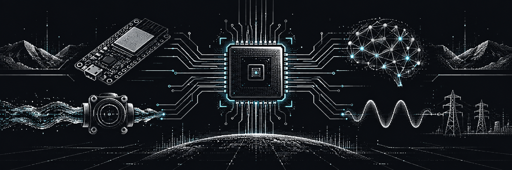
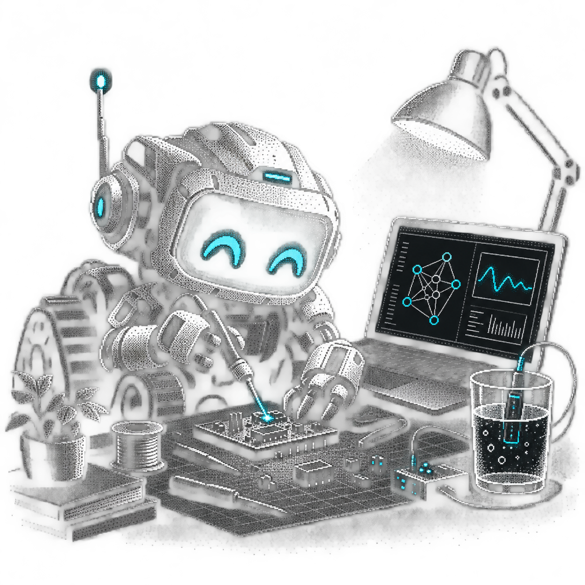

<p align="center">
  
</p>

<h1 align="center">Hi 👋, I'm Prapakorn “Beer” Phithamma</h1>

<p align="center">
  
</p>

<p align="center">
  <code>From sensor signals and documents to reliable, observable software.</code>
</p>

<p align="center">
  <a href="https://github.com/Mrbeer19?tab=repositories"></a>
  <a href="https://mrbeer19.github.io/water-control-dashboard/"></a>
  <a href="https://www.rmutt.ac.th/"></a>
</p>

---

## 🚀 About Me

<table>
  <tr>
    <td width="64%" valign="top">
      <p>
        I'm a Computer Engineering student at <strong>Rajamangala University of Technology Thanyaburi (RMUTT)</strong>.
        I enjoy working where software meets real systems—turning data into useful decisions, connecting AI components into dependable pipelines, and building interfaces that make complex operations understandable.
      </p>
      <p>
        My work currently spans <strong>LLMs and RAG</strong>, <strong>agentic AI</strong>, <strong>AIoT dashboards</strong>, and <strong>time-series forecasting</strong>. I care about measured results, visible failures, clear system boundaries, and software another engineer can confidently continue.
      </p>
      <p><strong>Direction:</strong> AI Engineering · Intelligent Systems · Full-stack Systems · Automation</p>
    </td>
    <td width="36%" align="center" valign="middle">
      
    </td>
  </tr>
</table>

---

## ⚙️ What I'm Building

```text
Sensors / Documents / APIs
          │
          ▼
  Reliable Data Pipeline
          │
     ┌────┴────┐
     ▼         ▼
 AI / Search   System Logic
     └────┬────┘
          ▼
  Useful, Observable UI
```

- 🧠 Evaluating **hybrid retrieval, reranking, RAG, and agentic AI**
- 💧 Building an **offline-first factory water monitoring and control dashboard**
- 🌐 Integrating **live weather, hazard, routing, and transit data** without hiding uncertainty
- ⚡ Experimenting with **LSTM electricity-consumption forecasting**

---

## 🧩 Selected Projects

| Project | What I built | Engineering highlights |
|---|---|---|
| [**Factory Water Control Dashboard**](https://github.com/Mrbeer19/water-control-dashboard) · [Live demo](https://mrbeer19.github.io/water-control-dashboard/) | AIoT capstone frontend for real-time monitoring, pump/valve control, alerts, reports, and predictive-maintenance views | Offline-first deployment, typed API boundary, Thai/English UI, automated consistency checks, CI and GitHub Pages |
| [**Advanced Topics in Computer Software**](https://github.com/Mrbeer19/04622404-Advanced-Topics-in-Computer-Software) | End-to-end RAG labs plus an Agentic AI external-data module | Hybrid retrieval, reranking, evaluation from scratch, reproducible failure analysis, 645 tests and 28 live-provider canaries |
| [**LLM Retrieval System**](https://github.com/Mrbeer19/DL-03-LLM-Retrieval-System) | A learning-first semantic retrieval pipeline over PDFs | Chunking, multilingual embeddings, FAISS vector search, top-k retrieval and reusable Python modules |
| [**Electricity Consumption Forecasting**](https://github.com/Mrbeer19/Electricity-Consumption-Forecasting) | Web app that predicts next-month electricity usage and cost | LSTM forecasting, Flask application, data generation and model-serving workflow |

---

## 💻 Tech Stack

<p align="center">
  
</p>

<p align="center">
  
  
  
  
</p>

```python
engineering_mindset = {
    "measure_before_claiming": True,
    "make_failures_visible": True,
    "design_for_handoff": True,
    "keep_learning": True,
}
```

---

## 📊 GitHub Stats

<p align="center">
  
  
</p>

<p align="center">
  
  
</p>

## 📈 Activity Overview

<p align="center">
  
</p>

---

<p align="center">
  <code>Build things that work · Measure what matters · Explain the trade-offs</code>
</p>

