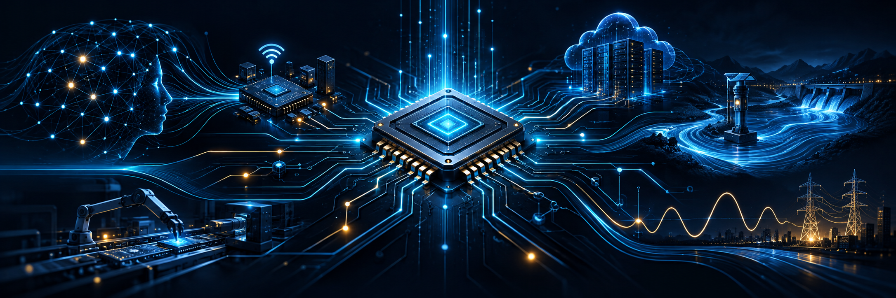

<p align="center">
  
</p>

<h1 align="center">Hi, I'm Prapakorn “Beer” Phithamma 👋</h1>

<p align="center">
  <strong>Computer Engineering Student @ RMUTT</strong><br/>
  Building reliable AI, intelligent software, and AIoT interfaces from data to deployment.
</p>

<p align="center">
  <a href="https://github.com/Mrbeer19?tab=repositories"></a>
  <a href="https://www.rmutt.ac.th/"></a>
</p>

---

### `> whoami`

I am a Computer Engineering student at **Rajamangala University of Technology Thanyaburi (RMUTT)**. I enjoy working where software meets real systems—turning data into useful decisions, connecting AI components into dependable pipelines, and building interfaces that make complex operations understandable.

- 🧠 Exploring **LLMs, RAG, retrieval evaluation, and agentic AI**
- 💧 Building an **AIoT factory water monitoring and control dashboard**
- ⚡ Experimenting with **time-series forecasting** for electricity consumption
- 🛠️ Interested in **AI engineering, full-stack systems, and intelligent automation**

### `> current_focus`

```text
Sensors / Documents / APIs
          │
          ▼
  Reliable Data Pipeline
          │
     ┌────┴────┐
     ▼         ▼
 AI / Search   System Logic
     └────┬────┘
          ▼
  Useful, Observable UI
```

My current work focuses on systems that stay honest about uncertainty: retrieval that is measured, external-data services that preserve provider truth, and dashboards whose numbers remain consistent across every time scale.

### `> selected_projects`

| Project | What I built | Engineering highlights |
|---|---|---|
| [**Factory Water Control Dashboard**](https://github.com/Mrbeer19/water-control-dashboard) · [Live demo](https://mrbeer19.github.io/water-control-dashboard/) | AIoT capstone frontend for real-time monitoring, pump/valve control, alerts, reports, and predictive-maintenance views | Offline-first deployment, typed API boundary, Thai/English UI, automated consistency checks, CI and GitHub Pages |
| [**Advanced Topics in Computer Software**](https://github.com/Mrbeer19/04622404-Advanced-Topics-in-Computer-Software) | End-to-end RAG labs plus an Agentic AI external-data module | Hybrid retrieval, reranking, evaluation from scratch, reproducible failure analysis, 645 tests and 28 live-provider canaries |
| [**LLM Retrieval System**](https://github.com/Mrbeer19/DL-03-LLM-Retrieval-System) | A learning-first semantic retrieval pipeline over PDFs | Chunking, multilingual embeddings, FAISS vector search, top-k retrieval and reusable Python modules |
| [**Electricity Consumption Forecasting**](https://github.com/Mrbeer19/Electricity-Consumption-Forecasting) | Web app that predicts next-month electricity usage and cost | LSTM forecasting, Flask application, data generation and model-serving workflow |

### `> engineering_toolbox`

<p>
  
  
  
  
  
  
  
  
  
</p>

```python
engineering_mindset = {
    "measure_before_claiming": True,
    "make_failures_visible": True,
    "design_for_handoff": True,
    "keep_learning": True,
}
```

### `> build_signals`

<p align="center">
  
  
</p>

<p align="center">
  <sub>Build things that work. Measure what matters. Explain the trade-offs.</sub>
</p>

